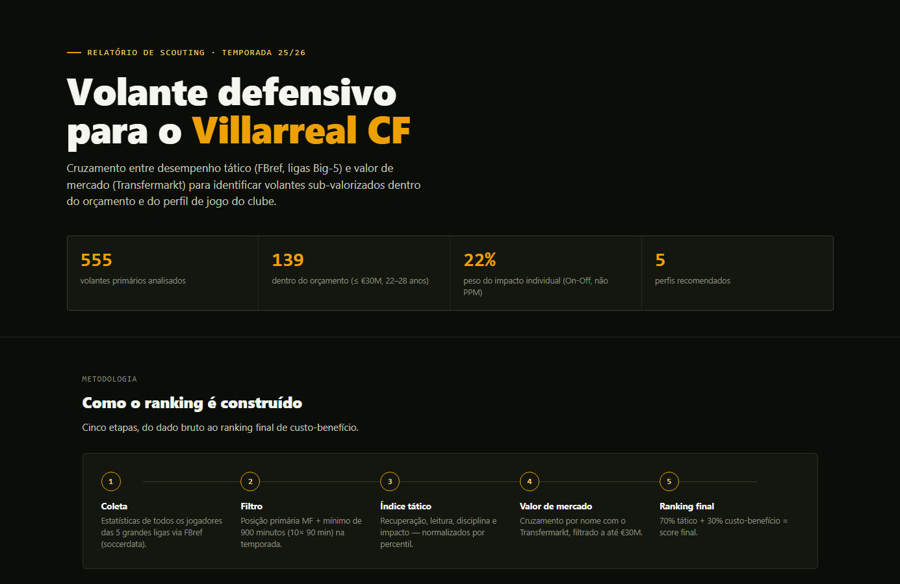

# Villarreal Midfielder Scout 🟡

A data-driven tool to identify the ideal defensive midfielder profile
for a mid-table La Liga club, inspired by the Moneyball philosophy.

**[→ Abrir o relatório completo (interativo)](https://nunocapao.github.io/villarreal-midfielder-scout/report.html)**

## Objective
Find undervalued defensive midfielders in European leagues that match
Villarreal CF's tactical identity: compact block, selective pressing,
fast vertical transitions — maximizing performance per euro invested.

## Stack
- Python · Pandas · Scikit-learn · FBref (via soccerdata) · Matplotlib

## Project Structure
data/        → raw and processed datasets
notebooks/   → exploratory analysis
src/         → scraper, metrics and model
outputs/     → rankings and visualizations

## Status
🚧 In progress